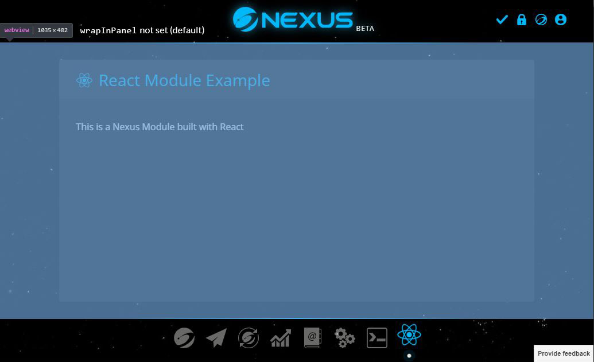
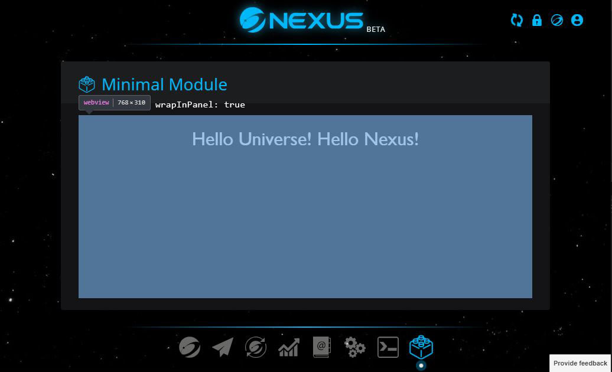

# `app` module type

`app` is the only Nexus Wallet Module type that's currently supported. When an `app` module is installed in your wallet, its icon will be added to the navigation bar at the bottom of the wallet, and when activated it opens up a separate page in your wallet, similarly to how the built-in modules like Transactions or Settings do.

## `<webview>` tag

On the technical side, when an `app` module is open, the module UI and code is executed inside a [`<webview>` tag](https://electronjs.org/docs/api/webview-tag). `webview` ensures that the module code execution environment is isolated from the base wallet for better security.

Since the module code is isolated inside a `webview`, it needs some ways to communicate with the base wallet to do useful things, such as to receive wallet data, do RPC calls, or get the common styles and current theme from the base wallet so that the module UI blends well into the wallet UI around. [`NEXUS` global variable](./nexus-globalvariable.md) exists for that reason. It is the bridge between your module and the base wallet, provides you all the necessary libraries, utilities, common components, and methods for interacting with the base wallet. See [`NEXUS` global variable](./nexus-globalvariable.md) for more details.

## `wrapInPanel` option

By default, module's `webview` will take up the whole area between the header and the navigation bar of your wallet (see image below). If you want to wrap your module UI in a `Panel` component, you'll have to render the `Panel` component in your module code yourself. This way you'll have a greater control on your UI, you can display a custom title on your `Panel`, add some buttons to right side of the `Panel`'s header, or customize it however you like. 



However, in case that you don't have those needs and just want to simplify your code, or you don't use React on your module (`Panel` is a React component), yet you still want your module UI to be wrapped in a `Panel`, in your [`nxs_package.json`](../nxs_package.json.md) you can add:

```
{
  // ...
  "options": {
    // Add this under `options`
    "wrapInPanel": true
  }
}
```

With that `wrapInPanel` option set as `true`, your module's `webview` will be wrapped inside a `Panel`'s body (see image below). The `Panel`'s title will be automatically set as your module's `displayName` preceeded by your module's icon.

